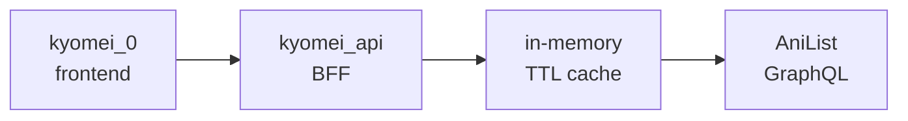

# Kyomei — 共鳴 (`kyomei_api`)

> Anime recommendations that resonate with you.

[](https://github.com/DavidRaet/kyomei_api/actions/workflows/ci.yml)


<!-- HUMAN INPUT: Add links here if applicable — e.g. a live demo URL, a hosted /docs URL, or the frontend (kyomei_0) repo link. Leave blank/remove if none exist yet. -->
[Demo] [API Docs]

---

## Overview

`kyomei_api` is a FastAPI backend-for-frontend (BFF) for [`kyomei_0`](https://github.com/DavidRaet/kyomei_0)<!-- adjust link if the frontend repo path differs -->, a TypeScript/Vite anime-tracking client. It orchestrates anime metadata from one upstream source — [AniList](https://anilist.co) (GraphQL, primary)  and is intended to eventually add personalized recommendation logic on top (see `docs/Kyomei-MVP-PRD-v2.1.md`).

<!-- HUMAN INPUT: Explain, in plain language for a non-technical reader, what Kyomei is and why it exists. -->

## Why Kyomei?

<!-- HUMAN INPUT: Explain why Kyomei exists, the problem you wanted to solve, your product philosophy, and what "resonance" (共鳴) means to you in this context. -->

## Current Status

This repository is **a working BFF for the three v1 anime endpoints — not yet a completed recommendation engine, and not yet caching anything.** Concretely, per `docs/fastapi-backend-setup-checklist.md`:

**Done:**
- Repo/project structure, `uv`-based dependency management, `ruff` lint/format config, `justfile` commands
- `GET /health`, plus all three contract endpoints — `GET /v1/anime/{malId}`, `GET /v1/anime/search`, `GET /v1/anime/{malId}/characters` — implemented against AniList's GraphQL API, with camelCase response schemas and contract-matching error handling (400/404/500)
- `app/anime/` (models, errors, `Provider` protocol) and `app/anilist/client.py` (the AniList GraphQL client) — domain logic and upstream client
- `app/config.py` wired up via `pydantic-settings` and loaded in `app/main.py` (though only `ANILIST_ENDPOINT` is actually read so far — see below)
- Router-level tests (`tests/test_routers_anime.py`) covering success, not-found, invalid-input, and upstream-error paths for all three endpoints, using a fake `Provider`
- `Dockerfile` (multi-layer `uv sync` build) verified locally
- CI (`.github/workflows/ci.yml`): lint + test + Docker build on every PR
- Deployed to Railway with environment variables mirrored from `.env.example`

**Not yet done:**
- **Caching** — `app/cache/` is still an empty stub module. Every request currently hits AniList directly; `CACHE_TTL_SECONDS` exists as a setting but nothing reads it yet, so despite `CONTRACT.md` describing these responses as cached, none of them are
- CORS middleware and request logging/rate limiting
- Unit tests for `app/anilist/client.py` against mocked HTTP responses; an integration test against a running server; local dev verification against a running frontend; frontend cutover
- Authentication, PostgreSQL, and recommendation logic — explicitly out of scope for this phase (see [Roadmap](#roadmap))

<!-- HUMAN INPUT: Add narrative framing of where the project stands and what "done" means for this phase, if you want more than the checklist summary above. -->

## Architecture

`kyomei_api` is a BFF, not the recommendation engine described in the PRD — its job in this phase is orchestration and caching only. It mirrors, server-side, the fallback pattern the frontend already implements client-side (`kyomei_0`'s `src/api/animeProvider.ts` → `anilist.ts` primary  / `cache.ts`).



Request flow per endpoint today: query AniList → return a normalized `AnimeSummary`/`CharacterSummary` shape (see `CONTRACT.md`). The "check cache" / "cache the result" steps shown in the diagram are the intended v1 shape but aren't implemented yet — `app/cache/` is still a stub, so every request hits AniList directly. AniList is the sole upstream source in v1 — there is no fallback provider (see `docs/Kyomei-MVP-PRD-v2.1.md`'s Design Decisions for why Jikan was dropped rather than kept as one).

## Tech Stack

| Layer | Choice | Source |
|---|---|---|
| Language / runtime | Python 3.14 | `.python-version` |
| Package manager | [`uv`](https://docs.astral.sh/uv/) | `pyproject.toml`, `uv.lock` |
| Web framework | FastAPI (≥0.141) | `pyproject.toml` |
| ASGI server | Uvicorn (`[standard]`, ≥0.52) | `pyproject.toml` |
| Outbound HTTP client | `httpx` (≥0.28) — planned for the AniList client | `pyproject.toml` |
| Config loading | `pydantic-settings` (≥2.15) — not yet wired up | `pyproject.toml`, `app/config.py` |
| Lint/format | `ruff` (≥0.16) | `pyproject.toml`, `justfile` |
| Testing | `pytest` (≥8.0) | `pyproject.toml`, `tests/` |
| Containerization | Docker, `ghcr.io/astral-sh/uv:python3.14-bookworm-slim` base image | `Dockerfile` |
| CI | GitHub Actions | `.github/workflows/ci.yml` |
| Hosting | Railway | `docs/fastapi-backend-setup-checklist.md` §8 |

## Project Structure

```
kyomei_api/
├── app/
│   ├── main.py       # FastAPI app creation, lifespan-managed AniListClient, GET /health, mounts app/routers/anime.py — wiring only
│   ├── anime/        # domain logic: models.py, errors.py, provider.py (Provider Protocol) — implemented; no separate orchestration/service.py yet
│   ├── anilist/      # client.py — async AniList GraphQL client (httpx) — implemented
│   ├── cache/        # stub — in-memory cache (e.g. cachetools.TTLCache) not yet implemented; Redis is a documented future upgrade
│   ├── routers/      # anime.py, schemas.py, errors.py — the three /v1/anime endpoints, camelCase Pydantic models, exception handlers — implemented
│   └── config.py     # pydantic-settings env/config loading — implemented; only ANILIST_ENDPOINT is actually read so far
├── tests/
│   └── test_health.py
├── docs/
│   ├── Kyomei-MVP-PRD-v2.1.md
│   ├── fastapi-backend-setup-checklist.md
│   └── learning/
│       ├── cicd-notes.md
│       └── docker-notes.md
├── CONTRACT.md
├── Dockerfile
├── justfile
├── pyproject.toml / uv.lock
└── .env.example
```

## Getting Started

**Prerequisites:** Python 3.14 (see `.python-version`) and [`uv`](https://docs.astral.sh/uv/getting-started/installation/).

```bash
git clone https://github.com/DavidRaet/kyomei_api.git
cd kyomei_api
uv sync
cp .env.example .env
just run   # = uv run uvicorn app.main:app --reload
```

The server starts on `http://localhost:8000` (or `$PORT` if set). Verify it's up:

```bash
curl http://localhost:8000/health        # {"status": "ok"}
```

Swagger UI is available at `http://localhost:8000/docs` (auto-generated by FastAPI; documents `/health` and the three `/v1/anime/...` routes).

**Run with Docker instead:**

```bash
docker build -t kyomei-api .
docker run --rm -p 8000:8000 kyomei-api
```

## API Documentation

The authoritative contract is [`CONTRACT.md`](./CONTRACT.md) — it is copy-pasted verbatim into both this repo and the frontend (`kyomei_0`) repo. If an endpoint, field, or status code isn't listed there, it doesn't exist yet.

| Method | Path | Status |
|---|---|---|
| `GET` | `/health` | **Implemented** |
| `GET` | `/v1/anime/{malId}` | **Implemented** (not yet cached — see [Current Status](#current-status)) |
| `GET` | `/v1/anime/search` | **Implemented** (not yet cached — see [Current Status](#current-status)) |
| `GET` | `/v1/anime/{malId}/characters` | **Implemented** (not yet cached — see [Current Status](#current-status)) |
| `POST` | `/v1/recommendations` | Proposed only — not part of the current contract |

All endpoints are public/unauthenticated in v1; response fields are `camelCase`; timestamps are Unix milliseconds. See `CONTRACT.md` for full request/response shapes, status codes, and examples.

## External Data Sources

| Source | Role | Protocol | Base URL (default) |
|---|---|---|---|
| [AniList](https://docs.anilist.co/guide/graphql/) | Sole data source (no fallback) | GraphQL | `https://graphql.anilist.co` |

## Configuration

Environment variables (see `.env.example`), loaded via `app/config.py`'s `pydantic-settings` `Settings` class.

| Variable | Default | Purpose | Actually read? |
|---|---|---|---|
| `PORT` | `8000` | Port Uvicorn binds to (Railway sets this in prod) | No — Uvicorn's own `$PORT` handling (see Deployment) is what actually binds the port; `Settings.port` isn't consulted |
| `ANILIST_ENDPOINT` | `https://graphql.anilist.co` | AniList GraphQL endpoint | Yes — passed into `AniListClient` at startup in `app/main.py` |
| `CACHE_TTL_SECONDS` | `300` | In-memory cache entry lifetime | No — `app/cache/` isn't implemented yet |

## Testing

```bash
just test   # = uv run pytest
uv run pytest tests/test_health.py::test_health_returns_ok   # single test
```

Current coverage: `tests/test_health.py` (`GET /health`) and `tests/test_routers_anime.py` (all three `/v1/anime/...` endpoints against a fake `Provider`, covering success, 404, 400, and 500 paths). Per the setup checklist's Testing section, still open: unit tests for `app/anilist/client.py` against mocked HTTP responses, and an integration test against a running server.

## CI/CD

`.github/workflows/ci.yml` runs two independent jobs on every PR and on push to `main`:

- **`lint-and-test`** — `uv sync`, `uv run ruff check`, `uv run pytest`
- **`docker-build`** — `docker build` only (no push/deploy)

See `docs/learning/cicd-notes.md` for the reasoning behind running these as separate parallel jobs.

## Deployment

The service is containerized via `Dockerfile`:

- Base image: `ghcr.io/astral-sh/uv:python3.14-bookworm-slim`
- Dependencies are installed in a layer separate from application code (`COPY pyproject.toml uv.lock ./` → `uv sync --no-install-project`, then `COPY app ./app` → `uv sync`), so editing source doesn't invalidate the dependency-install layer
- `CMD` reads `$PORT` at runtime via shell form (`sh -c "uvicorn ... --port ${PORT:-8000}"`), falling back to `8000` locally

Deploy target is **Railway** (per `docs/fastapi-backend-setup-checklist.md` §8), with environment variables mirrored from `.env.example`. See `docs/learning/docker-notes.md` for the full build/run/verify walkthrough.

<!-- HUMAN INPUT: Add a live URL here if the Railway deployment is publicly reachable, or note current deployment/traffic status. -->

## Engineering Decisions

- **FastAPI over Go** — this repo originally started as a Go scaffold (`go mod init` only, no source). Per the PRD's "Design Decisions" section, the backend language changed to Python/FastAPI because the core recommendation logic is a data-shaping/ranking problem better suited to Python's ecosystem, and FastAPI's async-native design plus Pydantic validation maps closely to the TypeScript interfaces already fixed in `CONTRACT.md`. The Go scaffold was retired (`go.mod` removed, `.gitignore` switched to Python-flavored) since there was no Go source to port.
- **Two independent CI jobs, not one** — `lint-and-test` and `docker-build` run in parallel so a slow Docker build never delays lint/test feedback on a PR (see `docs/learning/cicd-notes.md`).
- **Two-stage `uv sync` in the Dockerfile** — dependencies are installed before app code is copied in, so Docker's layer cache means editing application code doesn't re-trigger a dependency reinstall (see `docs/learning/docker-notes.md`).
- **No Redis, database, or auth in v1** — per the setup checklist, this phase is BFF-style orchestration and caching only; in-memory `TTLCache` is used instead of Redis, and personalization/auth/PostgreSQL are deferred to a later phase (see `CONTRACT.md`'s Scope section).
- **AniList as the sole upstream source, no Jikan fallback** — a Jikan REST client was implemented (`app/jikan/`) and then removed. Jikan is an unofficial scraper/wrapper around MyAnimeList's website rather than a first-party API, which made it flaky and rate-limit-prone; keeping an unreliable source as a "fallback" undermines the resilience a fallback is meant to provide and introduces its own point of failure rather than removing one. See `docs/Kyomei-MVP-PRD-v2.1.md`'s Design Decisions for the full writeup.

<!-- HUMAN INPUT: Explain the reasoning for choosing uv over Poetry (the setup checklist notes this explanation belongs here but doesn't state the reason itself). Add any other personally-made architectural tradeoffs, rejected alternatives, or lessons learned. -->

## Roadmap

Near-term (from `docs/fastapi-backend-setup-checklist.md`'s remaining unchecked sections and `CONTRACT.md`'s "Proposed / Not Yet Confirmed"):

- Implement `app/cache/` (in-memory TTL cache, e.g. `cachetools.TTLCache`) and wire `CACHE_TTL_SECONDS` into it — the biggest remaining gap, since `CONTRACT.md` already describes lookups/search/characters as cached
- Add CORS middleware and request logging/rate limiting
- Unit tests for `app/anilist/client.py` against mocked HTTP responses, plus an integration test against a running server
- Frontend cutover: point `kyomei_0`'s `animeProvider.ts` at this backend
- `POST /v1/recommendations` and watchlist endpoints (drafted in `CONTRACT.md`, not implemented — gated on personalization/auth work)

Longer-term, per `docs/Kyomei-MVP-PRD-v2.1.md` (out of scope for this repo's current phase): authentication (Auth0), PostgreSQL persistence, and personalized recommendation logic.

<!-- HUMAN INPUT: Add product-vision-level roadmap and prioritization beyond the technical checklist items above. -->

## Contributing

<!-- HUMAN INPUT: State whether this project accepts contributions and, if so, how. -->

## License

<!-- HUMAN INPUT: No LICENSE file currently exists in this repository — choose and add one (e.g. MIT) if you want the project openly licensed. -->

## Acknowledgements

<!-- HUMAN INPUT: Credit anyone/anything you'd like to acknowledge (e.g. AniList as a data provider, prior art, people who helped). -->
