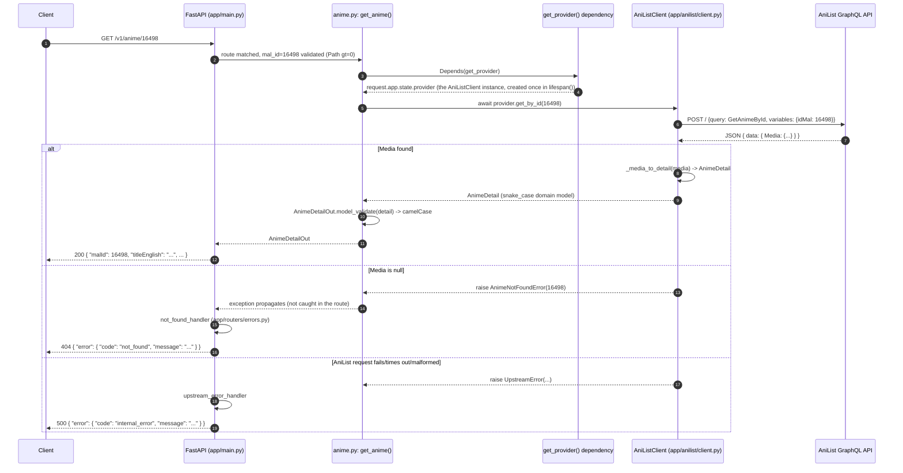

# Request/Response Cycle: `GET /v1/anime/{malId}`

## Why `app/anime/provider.py` looks empty

```python
@runtime_checkable
class Provider(Protocol):
    async def get_by_id(self, mal_id: int) -> AnimeDetail: ...
    async def search(self, q: str, limit: int = 20) -> list[AnimeSummary]: ...
    async def get_characters(self, mal_id: int) -> list[CharacterSummary]: ...
    async def get_trending(self, limit: int = 20) -> list[AnimeSummary]: ...
    async def get_seasonal(self, year: int, season: str, limit: int = 20) -> list[AnimeSummary]: ...
```

`Provider` is a [`typing.Protocol`](https://docs.python.org/3/library/typing.html#typing.Protocol) — Python's version of a structural interface, similar to a TypeScript `interface`. It is **never instantiated and never runs**. Its only job is to be a typed contract that other classes can satisfy just by having matching method signatures — no `class AniListClient(Provider):` inheritance required. That's why every method body is `...`.

`AniListClient` (`app/anilist/client.py`) satisfies `Provider` structurally: it happens to define `get_by_id`, `search`, and `get_characters` with the same signatures. The routers only ever depend on `Provider` (for the type checker's benefit); at runtime, what actually gets called is the real `AniListClient` instance created at app startup. If a second data source were ever added, it would just need to implement the same three methods — no shared base class needed.

## Sequence diagram: `GET /v1/anime/{malId}`



## What each layer actually owns

| Layer | File | Role |
|---|---|---|
| Router | `app/routers/anime.py` | Parses/validates the HTTP request (`mal_id: int = Path(..., gt=0)`), calls the provider, maps the domain model to the wire-format (camelCase) response model. No AniList-specific logic. |
| Dependency | `app/routers/anime.py::get_provider` | Reads `request.app.state.provider` — the single `AniListClient` instance created once at startup (see `lifespan()` in `app/main.py`), not a new one per request. |
| Protocol | `app/anime/provider.py` | Compile-time-only contract. Defines *what* a provider must do, never *how*. |
| Domain models/errors | `app/anime/models.py`, `app/anime/errors.py` | `AnimeSummary`/`AnimeDetail`/`CharacterSummary`/`VoiceActorSummary` (snake_case, upstream-agnostic), `AnimeNotFoundError`/`UpstreamError`. |
| Concrete provider | `app/anilist/client.py` | The only class that actually talks to AniList: builds the GraphQL query, sends it via `httpx`, maps the JSON response into domain models, translates AniList-specific failure modes into the shared domain errors above. |
| Error mapping | `app/routers/errors.py` | Registered on the `FastAPI` app; catches domain errors/`RequestValidationError` and turns them into the `{ "error": { "code", "message" } }` shape from `CONTRACT.md`. |

`search` and `get_characters` follow the identical shape — same dependency, same `Provider` call, same `AniListClient` implementation, just a different GraphQL query and a different response envelope (`AnimeSearchOut` / `CharactersOut`).
